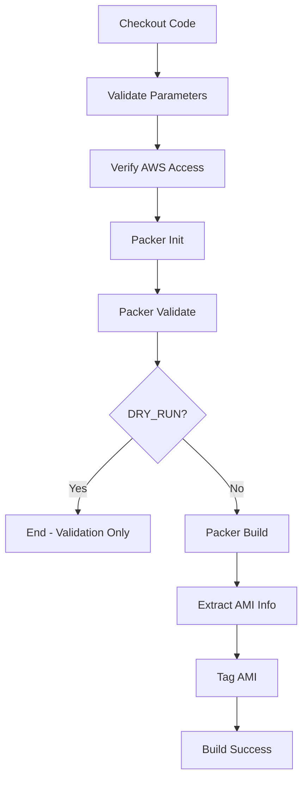

# Packer AMI Building Project

這個專案使用 Packer 建構 AWS AMI，支援多個環境和專案類型。提供手動執行和 Jenkins CI/CD 兩種方式。

## 專案結構

```
packer/
├── README.md                     # 專案說明文件
├── Jenkinsfile                   # Jenkins Pipeline 配置
├── base/                         # 基礎 AMI 建構
│   ├── plugins.pkr.hcl          # Packer plugins 定義
│   ├── variables.pkr.hcl        # 變數定義
│   ├── source.pkr.hcl           # AMI 來源配置
│   ├── build.pkr.hcl            # 建構流程定義
│   ├── common.pkrvars.hcl       # 共用變數值
│   ├── env/                     # 環境特定變數
│   │   ├── dev.pkrvars.hcl
│   │   ├── stg.pkrvars.hcl
│   │   └── prod.pkrvars.hcl
│   ├── scripts/                 # 部署腳本
│   └── metadata/                # AMI 建構結果
└── mps-openresty/               # OpenResty Web Server AMI
    ├── plugins.pkr.hcl          # Packer plugins 定義
    ├── variables.pkr.hcl        # 變數定義
    ├── source.pkr.hcl           # AMI 來源配置
    ├── build.pkr.hcl            # 建構流程定義
    ├── common.pkrvars.hcl       # 共用變數值
    ├── env/                     # 環境特定變數
    │   ├── dev.pkrvars.hcl
    │   ├── stg.pkrvars.hcl
    │   └── prod.pkrvars.hcl
    ├── scripts/                 # 部署腳本
    └── metadata/                # AMI 建構結果
```

## 支援的專案類型

### 1. base
基礎 AMI，包含基本的系統配置和套件，作為其他 AMI 的基底。

**特色：**
- Ubuntu 20.04 LTS 基礎
- 基本系統更新和套件安裝
- 系統優化配置

### 2. mps-openresty
基於 base AMI 建構的 Web Server AMI，包含 OpenResty + Docker 環境。

**特色：**
- 基於 base AMI
- OpenResty (Nginx + Lua)
- Docker 容器運行環境
- 預配置的防火牆設定

## 使用方式

### 方式一：手動執行

#### 前置需求
```bash
# 安裝 Packer
curl -fsSL https://apt.releases.hashicorp.com/gpg | sudo apt-key add -
sudo apt-add-repository "deb [arch=amd64] https://apt.releases.hashicorp.com $(lsb_release -cs) main"
sudo apt-get update && sudo apt-get install packer

# 設定 AWS 認證
aws configure
# 或使用環境變數
export AWS_ACCESS_KEY_ID="your-access-key"
export AWS_SECRET_ACCESS_KEY="your-secret-key"
export AWS_DEFAULT_REGION="ap-northeast-1"
```

#### 執行步驟

1. **進入專案目錄**
   ```bash
   cd mps-openresty  # 或 cd base
   ```

2. **初始化 Packer**
   ```bash
   packer init .
   ```

3. **驗證配置**
   ```bash
   # 使用環境配置檔案
   packer validate -var-file=env/dev.pkrvars.hcl -var-file=common.pkrvars.hcl .
   
   # 或自訂參數
   packer validate \
     -var-file=env/dev.pkrvars.hcl \
     -var-file=common.pkrvars.hcl \
     -var="base_ami_id=ami-0030a0ad1a88f5eb8" \
     .
   ```

4. **建構 AMI**
   ```bash
   # 使用環境配置檔案
   packer build -var-file=env/dev.pkrvars.hcl -var-file=common.pkrvars.hcl .
   
   # 或自訂參數
   packer build \
     -var-file=env/dev.pkrvars.hcl \
     -var-file=common.pkrvars.hcl \
     -var="base_ami_id=ami-0030a0ad1a88f5eb8" \
     -var="region=ap-northeast-1" \
     -var="instance_type=t3.micro" \
     .
   ```

5. **查看建構結果**
   ```bash
   cat metadata/dev/dev-manifest.json
   ```

#### 手動執行的優點
- ✅ 完全控制建構過程
- ✅ 可以即時查看輸出和錯誤
- ✅ 適合開發和測試
- ✅ 可以使用 `-on-error=ask` 進行除錯

#### 手動執行的缺點
- ❌ 需要手動管理環境變數
- ❌ 需要本地安裝 Packer 和 AWS CLI
- ❌ 沒有版本控制和審核流程
- ❌ 容易因環境差異產生問題

---

### 方式二：Jenkins CI/CD 執行

#### 前置需求
1. **Jenkins 環境設定**
   ```bash
   # 安裝必要的 Jenkins plugins
   - Pipeline
   - AWS Credentials Plugin
   - AnsiColor Plugin (選用，用於顯示彩色輸出)
   - Pipeline Utility Steps Plugin (用於讀取 JSON)
   ```

2. **AWS 認證設定**
   - 在 Jenkins 中設定 AWS Credentials
   - 或確保 Jenkins 伺服器已配置 AWS CLI 認證

3. **系統環境**
   - Jenkins 伺服器需安裝 Packer
   - Jenkins 伺服器需安裝 AWS CLI

#### 使用步驟

1. **建立 Pipeline Job**
   - 在 Jenkins 中建立新的 Pipeline 專案
   - 指向此專案的 `Jenkinsfile`

2. **配置建構參數**
   ```
   ENVIRONMENT: dev/stg/prod         # 選擇環境
   PROJECT_TYPE: mps-openresty       # 選擇專案類型
   AWS_REGION: ap-northeast-1        # 選擇 AWS 區域
   INSTANCE_TYPE: t3.micro           # 選擇實例類型
   BASE_AMI_ID: (選填)               # 自訂基底 AMI ID
   OWNER: infra-team                 # 資源擁有者
   DRY_RUN: false                    # 是否只驗證不建構
   ```

3. **執行建構**
   - 點擊 "Build with Parameters"
   - 填入所需參數
   - 開始建構

#### Jenkins Pipeline 流程



#### Jenkins 執行的優點
- ✅ 標準化建構流程
- ✅ 自動化參數驗證
- ✅ 建構歷史記錄和日誌
- ✅ 權限控制和審核
- ✅ 支援多環境配置
- ✅ 自動標籤管理
- ✅ 錯誤處理和通知

#### Jenkins 執行的缺點
- ❌ 需要設定 Jenkins 環境
- ❌ 需要管理 Jenkins credentials
- ❌ 除錯相對困難
- ❌ 依賴 Jenkins 伺服器狀態

---

## 兩種方式的主要差異

| 項目 | 手動執行 | Jenkins 執行 |
|------|----------|--------------|
| **設定複雜度** | 低 | 中高 |
| **執行便利性** | 需要指令知識 | GUI 操作 |
| **參數管理** | 手動指定 | 表單選擇 |
| **錯誤除錯** | 容易 | 需查看日誌 |
| **版本控制** | 手動管理 | 自動記錄 |
| **多人協作** | 困難 | 容易 |
| **權限控制** | 依賴系統權限 | 細粒度控制 |
| **建構歷史** | 無 | 完整記錄 |
| **通知機制** | 無 | 支援多種通知 |
| **環境隔離** | 依賴本地環境 | 統一環境 |

## 建議使用場景

### 手動執行適合：
- 🔧 開發和測試階段
- 🔧 快速驗證配置
- 🔧 除錯和故障排查
- 🔧 學習和實驗

### Jenkins 執行適合：
- 🏢 生產環境部署
- 🏢 團隊協作開發
- 🏢 定期自動建構
- 🏢 合規和審核需求

## 環境變數說明

### 必要變數
- `env`: 環境標識 (dev/stg/prod)
- `region`: AWS 區域
- `instance_type`: EC2 實例類型
- `base_ami_id`: 基底 AMI ID (僅限 mps-openresty)

### 選用變數
- `ssh_username`: SSH 連接用戶名 (預設: ubuntu)
- `owner`: 資源擁有者標籤 (預設: infra-team)

## 故障排除

### 常見問題

1. **AMI 名稱重複**
   ```
   Error: AMI name xxx is already in use
   ```
   **解決方案：** AMI 名稱包含時間戳，通常是因為有重複的 build 區塊

2. **AWS 認證問題**
   ```
   Error: AWS credentials not found
   ```
   **解決方案：** 確認 AWS CLI 配置或環境變數設定

3. **Packer plugins 下載失敗**
   ```
   Error: Failed to download plugin
   ```
   **解決方案：** 確認網路連接，執行 `packer init .`

## 進階用法

### 除錯模式
```bash
# 啟用詳細日誌
PACKER_LOG=1 packer build -var-file=env/dev.pkrvars.hcl .

# 建構失敗時保留執行個體
packer build -on-error=ask -var-file=env/dev.pkrvars.hcl .
```

### 自訂建構
```bash
# 覆蓋特定變數
packer build \
  -var-file=env/dev.pkrvars.hcl \
  -var="instance_type=t3.small" \
  -var="base_ami_id=ami-custom123" \
  .
```

## 貢獻指南

1. Fork 此專案
2. 建立 feature branch
3. 提交變更
4. 建立 Pull Request

## 授權

此專案採用 MIT 授權條款。