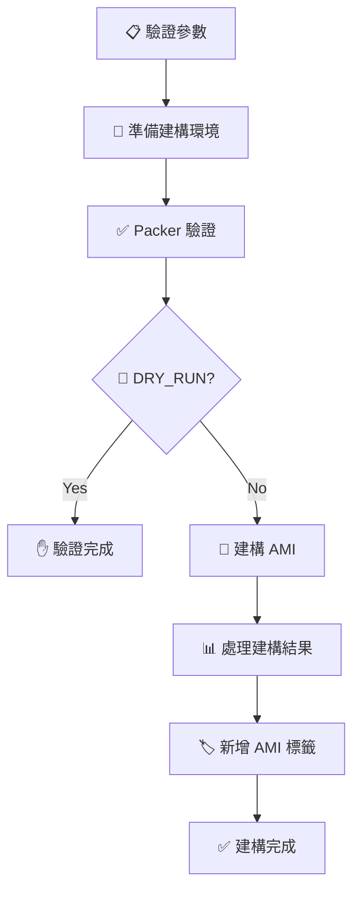

# 動態積木式 AMI 建構系統

這個專案使用 Packer 實現動態積木式 AMI 建構，支援彈性組合不同的系統組件、應用程式和配置。通過 Jenkins Pipeline 提供標準化的建構流程。

## 🚀 核心特色

- **🧩 動態積木組合**：模組化設計，可彈性組合不同積木
- **🔄 多作業系統支援**：Ubuntu、Amazon Linux、RHEL 系列
- **⚙️ 智能條件執行**：只執行選擇的積木相關腳本
- **🏷️ 自動標籤分類**：智能分類並標記不同類型的積木
- **🔐 安全性內建**：防火牆、fail2ban、系統加固
- **📊 Jenkins 整合**：標準化建構流程和結果追蹤

## 📁 專案結構

```
packer/
├── README.md                     # 專案說明文件
├── Jenkinsfile                   # Jenkins Pipeline 配置
├── engine/                       # 動態建構引擎
│   └── builder.pkr.hcl           # 主要 Packer 配置檔案
└── blocks/                       # 積木庫
    ├── base/                     # 基礎系統積木
    │   ├── ubuntu-2004/          # Ubuntu 20.04 基礎積木
    │   ├── amazon-linux-2/       # Amazon Linux 2 基礎積木
    │   └── rhel-8/               # RHEL 8 基礎積木
    ├── applications/             # 應用程式積木
    │   ├── docker/               # Docker 容器引擎
    │   │   ├── block.yaml        # 積木配置檔案
    │   │   └── scripts/          # 多作業系統腳本
    │   │       ├── debian/       # Debian/Ubuntu 專用
    │   │       ├── rhel/         # RHEL 系列專用
    │   │       ├── amazon-linux/ # Amazon Linux 專用
    │   │       └── common/       # 共用腳本
    │   └── openresty/            # OpenResty Web Server
    │       ├── block.yaml
    │       └── scripts/
    └── configurations/           # 配置積木
        ├── security/             # 安全配置
        ├── monitoring/           # 監控配置
        └── logging/              # 日誌配置
```

## 🧩 積木系統說明

### 積木分層架構

本系統採用清晰的分層架構，確保不同類型的軟體和配置能夠正確歸類，提高維護性和重用性。

#### 🏗️ 四層架構設計

```
┌─────────────────────────────────────────────────────┐
│         第4層: 配置管理 (Ansible/cloud-init)         │
│  - 環境差異化配置                                    │
│  - 動態參數注入                                      │
│  - 實例特定設定                                      │
├─────────────────────────────────────────────────────┤
│         第3層: 自定義積木 (Custom Blocks)            │
│  - 商業授權軟體                                      │
│  - 客戶專有應用                                      │
│  - 行業特定系統                                      │
├─────────────────────────────────────────────────────┤
│         第2層: 通用服務積木 (Application Blocks)     │
│  - 開源中介軟體                                      │
│  - 通用資料庫                                        │
│  - 開發框架和運行環境                                │
├─────────────────────────────────────────────────────┤
│         第1層: 基礎系統積木 (Base Blocks)            │
│  - 作業系統核心                                      │
│  - 系統工具和更新                                    │
│  - 基礎安全設定                                      │
└─────────────────────────────────────────────────────┘
```

#### 📊 分層判斷標準

| 判斷條件 | 通用服務積木 (第2層) | 自定義積木 (第3層) |
|---------|---------------------|-------------------|
| **授權類型** | 開源/免費軟體 | 商業授權/專有軟體 |
| **通用程度** | 跨行業通用 | 特定客戶/行業 |
| **配置複雜度** | 標準化配置 | 高度客製化 |
| **保密等級** | 公開資訊 | 可能包含商業機密 |
| **更新管理** | 社群維護 | 客戶自行控制 |

#### 💡 具體分類範例

**✅ 應放在通用服務層（第2層）的積木：**
```yaml
# 開源且通用的服務
app-nginx          # 開源 Web 伺服器
app-postgresql     # 開源關聯式資料庫
app-redis          # 開源記憶體快取
app-elasticsearch  # 開源搜尋引擎
app-docker         # 開源容器平台
app-jenkins        # 開源 CI/CD 工具
app-prometheus     # 開源監控系統
```

**✅ 應放在自定義層（第3層）的積木：**
```yaml
# 需要特殊授權或高度客製化
custom-oracle-db           # 商業資料庫，需授權
custom-sap-erp            # 企業級 ERP 系統
custom-clientA-backend    # 客戶 A 的專有後端服務
custom-trading-platform   # 金融交易系統
custom-hospital-his       # 醫院資訊系統
custom-dynatrace-agent    # 商業監控工具
```

### 積木類型

#### 1. 基礎系統積木 (Base Blocks)
提供作業系統基礎環境，每次建構必須選擇一個基礎積木。

**可用積木：**
- `base-ubuntu-2004`: Ubuntu 20.04 LTS 基礎系統
- `base-ubuntu-2204`: Ubuntu 22.04 LTS 基礎系統  
- `base-amazon-linux-2`: Amazon Linux 2 基礎系統
- `base-rhel-8`: Red Hat Enterprise Linux 8 基礎系統

**包含功能：**
- 系統更新和基本套件安裝
- 系統優化配置
- 基礎安全設定

#### 2. 應用程式積木 (Application Blocks)  
提供特定應用程式和服務，可選擇多個應用積木。

**可用積木：**
- `app-docker`: Docker 容器引擎 + Docker Compose
- `app-openresty`: OpenResty Web Server (Nginx + Lua)
- `app-nginx`: 標準 Nginx Web Server
- `app-nodejs`: Node.js 運行環境

**功能特色：**
- 多作業系統支援腳本
- 自動服務啟動配置
- 版本驗證和健康檢查

#### 3. 配置積木 (Configuration Blocks)
提供系統配置和安全加固，可選擇多個配置積木。

**可用積木：**
- `config-security`: 防火牆 + fail2ban + 系統加固
- `config-monitoring`: 系統監控和日誌收集
- `config-logging`: 中央化日誌配置
- `config-backup`: 自動備份配置

**安全功能：**
- UFW 防火牆配置
- fail2ban 入侵防護
- SSH 安全加固
- 系統權限優化

## 🏷️ 智能標籤系統

AMI 建構完成後，系統會自動根據選擇的積木類型建立分類標籤：

### 標籤結構
```yaml
# 基本標籤
JenkinsBuild: "建構編號"
Requester: "請求者"
BuildDate: "建構日期"

# 積木分類標籤（根據選擇的積木動態生成）
Base: "ubuntu-2004"                    # 基礎系統（單一值）
Applications: "docker_openresty"        # 應用程式（多值用底線分隔）
Configurations: "security_monitoring"   # 配置（多值用底線分隔）  
Custom: "special_tool"                  # 自定義積木
```

### 標籤範例
**選擇積木：** `["base-ubuntu-2004", "app-docker", "app-nginx", "config-security", "config-monitoring"]`

**產生標籤：**
- `Base: ubuntu-2004`
- `Applications: docker_nginx`
- `Configurations: security_monitoring`

## 📋 使用方式

### Jenkins Pipeline 執行

#### 1. 建立 Pipeline Job
- 在 Jenkins 中建立新的 Pipeline 專案
- 指向此專案的 `Jenkinsfile`

#### 2. 配置建構參數

| 參數 | 說明 | 範例值 |
|------|------|--------|
| `ENABLED_BLOCKS` | 選擇的積木列表 (JSON格式) | `["base-ubuntu-2004","app-docker","config-security"]` |
| `ENVIRONMENT` | 目標環境 | `dev`, `stg`, `prod` |
| `AWS_REGION` | AWS 區域 | `ap-northeast-1` |
| `INSTANCE_TYPE` | EC2 實例類型 | `t3.micro`, `t3.small` |
| `BASE_AMI_ID` | 基底 AMI ID (必填) | `ami-0836e97b3d843dd82` |
| `BUILD_NAME` | 自訂建構名稱 | `webserver`, `database` |
| `OWNER` | 資源擁有者 | `infra-team` |
| `DRY_RUN` | 僅驗證不建構 | `false` |

#### 3. 常用積木組合範例

**基礎 Web Server：**
```json
["base-ubuntu-2004", "app-nginx", "config-security"]
```

**Docker 開發環境：**
```json
["base-ubuntu-2004", "app-docker", "config-security", "config-monitoring"]
```

**OpenResty Web Server：**
```json
["base-ubuntu-2004", "app-openresty", "config-security"]
```

**多用途應用伺服器：**
```json
["base-ubuntu-2004", "app-docker", "app-nginx", "config-security", "config-monitoring", "config-logging"]
```

## 🔧 Jenkins Pipeline 流程



## 🛠️ 積木開發指南

### 新增積木的步驟

1. **建立積木目錄結構**
   ```bash
   mkdir -p blocks/applications/myapp/{scripts/{debian,rhel,amazon-linux,common}}
   ```

2. **建立 block.yaml 配置檔案**
   ```yaml
   name: "myapp"
   description: "My Application Block"
   version: "1.0.0"
   category: "application"
   
   os_support:
     - os_family: "debian"
       os_versions: ["20.04", "22.04"]
       scripts:
         install: "scripts/debian/install.sh"
         configure: "scripts/debian/configure.sh"
         validate: "scripts/common/validate.sh"
   
   dependencies:
     - "base-ubuntu-2004"
   
   tags:
     - "myapp"
     - "web"
   ```

3. **編寫安裝腳本**
   - `scripts/debian/install.sh`: Debian/Ubuntu 安裝腳本
   - `scripts/rhel/install.sh`: RHEL 系列安裝腳本  
   - `scripts/common/configure.sh`: 通用配置腳本
   - `scripts/common/validate.sh`: 驗證腳本

4. **更新 builder.pkr.hcl**
   在主要建構檔案中新增對應的 provisioner

## 🎯 積木選擇與分層實踐指南

### 完整部署架構範例

假設您要為客戶 A 建立一個 Java Web 應用環境：

```yaml
# 第1層 - 基礎系統
base-ubuntu-2004              # Ubuntu 20.04 作業系統

# 第2層 - 通用服務 (開源軟體)
app-nginx                     # 反向代理
app-postgresql               # 開源資料庫
app-redis                    # 快取服務
app-openjdk-11              # Java 運行環境

# 第3層 - 自定義積木 (客戶專有)
custom-clientA-webapp        # 客戶 A 的 Java 應用程式
custom-oracle-jdbc-driver    # Oracle 商業驅動程式
custom-dynatrace-agent       # 商業監控代理

# 第4層 - Ansible 配置 (實例啟動後執行)
ansible-playbook: clientA-production.yml
- 設定資料庫連線字串
- 配置 API 端點
- 注入授權金鑰
```

### 分層決策流程圖

```
新軟體需要加入系統？
    │
    ├─ 是開源/免費軟體嗎？
    │   │
    │   ├─ 是 → 是否通用（多客戶可用）？
    │   │         │
    │   │         ├─ 是 → 放入第2層 (app-*)
    │   │         └─ 否 → 放入第3層 (custom-*)
    │   │
    │   └─ 否 → 放入第3層 (custom-*)
    │
    └─ 只是配置修改？ → 使用 Ansible/cloud-init (第4層)
```

### 實際使用案例比較

| 需求 | 錯誤做法 ❌ | 正確做法 ✅ |
|-----|------------|------------|
| 安裝 Nginx | 放在 custom 層 | 放在 app 層 (app-nginx) |
| 安裝 Oracle Database | 放在 app 層 | 放在 custom 層 (custom-oracle-db) |
| 修改 Nginx 配置 | 寫入 Packer 積木 | 使用 Ansible 配置 |
| 安裝客戶應用程式 | 使用 cloud-init | 建立 custom 積木 |

## 🚨 故障排除

### 常見問題

#### 1. SSH 連線中斷
```
Error: Script disconnected unexpectedly
```
**原因：** Docker 或系統服務重啟導致 SSH 斷線  
**解決方案：** 已在相關 provisioner 中加入 `expect_disconnect = true`

#### 2. 條件執行問題
```
Error: Amazon Linux scripts running on Ubuntu
```
**原因：** Packer 條件執行邏輯錯誤  
**解決方案：** 使用 `except` 指令取代 `only` 指令

#### 3. 標籤格式錯誤
```
Error: Invalid type for parameter Tags.Value
```
**原因：** AWS CLI 不支援陣列格式的標籤值  
**解決方案：** 使用智能標籤系統分類處理

#### 4. debconf 前端錯誤
```
debconf: unable to initialize frontend: Dialog
```
**說明：** 這是正常現象，系統會自動降級到 Teletype 模式，不影響安裝

### 除錯技巧

1. **啟用詳細日誌**
   ```bash
   export PACKER_LOG=1
   packer build ...
   ```

2. **檢查積木配置**
   ```bash
   packer validate -var 'enabled_blocks=["base-ubuntu-2004"]' builder.pkr.hcl
   ```

3. **驗證 AWS 權限**
   ```bash
   aws sts get-caller-identity
   aws ec2 describe-images --owners self
   ```

## 📈 最佳實踐

### 積木選擇建議

1. **基礎積木選擇**
   - 開發環境：Ubuntu 20.04（穩定、資源豐富）
   - 生產環境：Amazon Linux 2（AWS 優化）
   - 企業環境：RHEL 8（商業支援）

2. **應用積木組合**
   - Web 應用：`app-nginx` + `config-security`
   - 容器化環境：`app-docker` + `config-monitoring`
   - 高效能 Web：`app-openresty` + `config-security`

3. **配置積木選擇**
   - 生產環境必備：`config-security`
   - 監控需求：`config-monitoring` + `config-logging`
   - 備份需求：`config-backup`

### 效能優化

1. **實例類型選擇**
   - 開發測試：`t3.micro` (1 vCPU, 1GB RAM)
   - 小型應用：`t3.small` (2 vCPU, 2GB RAM)
   - 中型應用：`t3.medium` (2 vCPU, 4GB RAM)

2. **建構時間優化**
   - 使用較大的實例類型進行建構
   - 預先下載常用套件到 base 積木
   - 並行執行無依賴的積木

## 🤝 貢獻指南

1. Fork 此專案
2. 建立 feature branch (`git checkout -b feature/amazing-block`)
3. 提交變更 (`git commit -m 'Add amazing block'`)
4. Push 到分支 (`git push origin feature/amazing-block`)
5. 建立 Pull Request

### 積木貢獻規範

- 每個積木必須包含 `block.yaml` 配置檔案
- 支援多作業系統的積木必須提供對應腳本
- 所有腳本必須包含錯誤處理 (`set -e`)
- 新增積木需要更新文件和範例

## 📜 授權

此專案採用 MIT 授權條款。詳見 `LICENSE` 檔案。

---

**聯絡資訊：**  
如有問題或建議，請建立 Issue 或聯繫專案維護者。