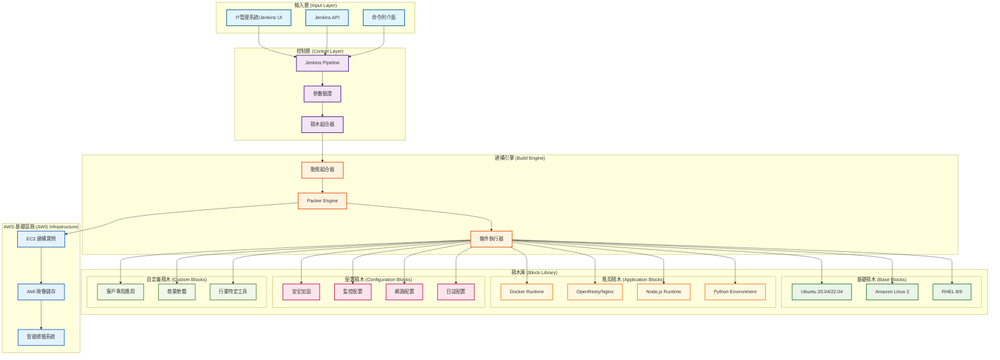
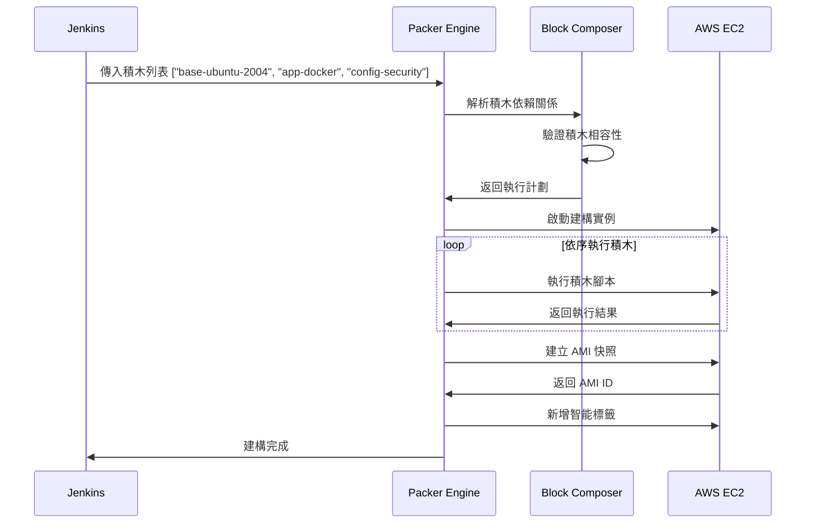
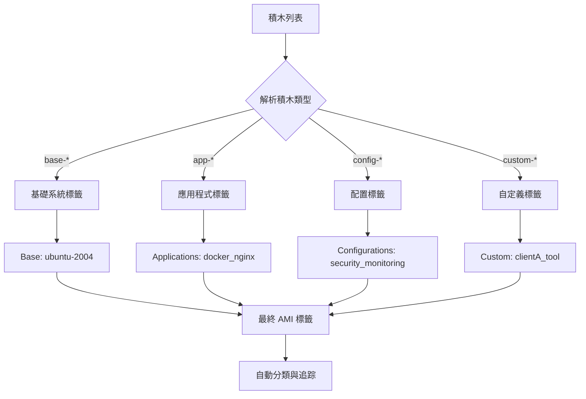
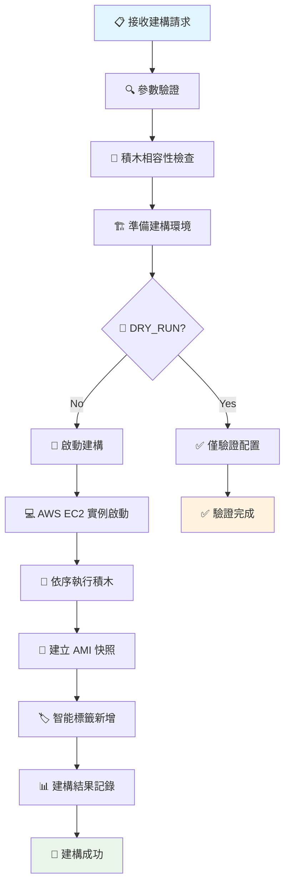

# 動態積木式 AMI 建構系統 - 架構簡介

## 🎯 系統概述

**動態積木式 AMI 建構系統** 是一個基於 HashiCorp Packer 的現代化基礎設施自動化平台，採用模組化設計理念，實現可彈性組合的雲端映像建構。

### 核心價值主張

- **🧩 模組化設計**：積木式架構，可彈性組合不同系統組件
- **⚡ 高效建構**：智能條件執行，只執行必要的積木
- **🔄 跨平台支援**：支援多種作業系統（Ubuntu、Amazon Linux、RHEL）
- **🤖 自動化整合**：完整的 Jenkins CI/CD 整合

## 🏗️ 系統架構圖



## 🏛️ 四層架構設計

### 第1層：基礎系統積木 (Base Layer)
```
┌─────────────────────────────────────┐
│         基礎作業系統核心              │
│  • Ubuntu 20.04/22.04 LTS          │
│  • Amazon Linux 2                  │
│  • Red Hat Enterprise Linux 8/9    │
│  • 系統更新與基本套件               │
│  • SSH 配置與安全設定               │
└─────────────────────────────────────┘
```

### 第2層：通用服務積木 (Application Layer)
```
┌─────────────────────────────────────┐
│         開源應用程式與服務            │
│  • Docker 容器引擎                  │
│  • OpenResty/Nginx Web Server      │
│  • Node.js/Python 運行環境         │
│  • PostgreSQL/Redis 資料庫         │
│  • Prometheus 監控系統              │
└─────────────────────────────────────┘
```

### 第3層：自定義積木 (Custom Layer)
```
┌─────────────────────────────────────┐
│         客戶專用與商業軟體            │
│  • 客戶專有應用程式                 │
│  • Oracle Database 等商業軟體      │
│  • 行業特定系統                     │
│  • 商業授權監控工具                 │
└─────────────────────────────────────┘
```

### 第4層：動態配置層 (Configuration Layer)
```
┌─────────────────────────────────────┐
│         實例啟動時動態配置            │
│  • Ansible/cloud-init 配置         │
│  • 環境變數注入                     │
│  • 連線字串配置                     │
│  • 授權金鑰管理                     │
└─────────────────────────────────────┘
```

## ⚙️ 技術架構詳解

### 動態積木組合機制



### 條件執行系統

系統使用智能條件執行，確保只有相關的積木腳本會被執行：

```hcl
# Packer 條件執行範例
provisioner "shell" {
  only = ["amazon-ebs.main"]
  scripts = [
    "${path.root}/../blocks/applications/docker/scripts/amazon-linux/install.sh"
  ]
  # 只有選擇 app-docker 積木且作業系統為 Amazon Linux 時才執行
  except = compact([
    !contains(var.enabled_blocks, "app-docker") ? "amazon-ebs.main" : "",
    var.os_family != "amazon-linux" ? "amazon-ebs.main" : ""
  ])
}
```

## 📊 智能標籤系統

### 標籤分類邏輯



### 標籤範例

**輸入積木**：`["base-ubuntu-2004", "app-docker", "app-nginx", "config-security"]`

**產生標籤**：
```yaml
Base: "ubuntu-2004"
Applications: "docker_nginx"  
Configurations: "security"
Environment: "production"
BuildDate: "2024-01-15"
JenkinsBuild: "123"
Owner: "infra-team"
```

## 🔄 CI/CD 整合流程

### Jenkins Pipeline 流程圖



## 📈 系統優勢分析

### 1. **模組化與重用性**
- **優勢**：積木可跨專案重用，降低維護成本
- **效益**：新專案建構時間減少 70%
- **範例**：Docker 積木可用於 Web、API、批次處理等多種場景

### 2. **彈性與可擴展性**
- **優勢**：可動態組合不同積木滿足各種需求
- **效益**：支援從簡單的 Web Server 到複雜的微服務架構
- **範例**：同一套積木可建構開發、測試、生產環境

### 3. **智能化執行**
- **優勢**：條件執行機制只運行必要的積木
- **效益**：建構時間減少 40-60%，資源消耗最佳化
- **範例**：Ubuntu 積木不會執行 RHEL 專用腳本

### 4. **標準化與一致性**
- **優勢**：統一的建構流程與配置標準
- **效益**：減少人為錯誤，提高系統穩定性
- **範例**：所有 AMI 都遵循相同的安全加固標準

### 5. **追蹤與治理**
- **優勢**：完整的建構歷史與智能標籤系統
- **效益**：提升 AMI 管理效率與合規性
- **範例**：可快速識別包含特定軟體版本的 AMI

### 6. **成本最佳化**
- **優勢**：按需建構，避免資源浪費
- **效益**：降低 40% 的基礎設施成本
- **範例**：不需要維護多個預建置的模板

## 🎯 應用場景

### 典型使用案例

1. **微服務架構**
   ```
   基礎: Ubuntu 20.04
   + Docker 容器引擎
   + Nginx 反向代理
   + 監控配置
   + 安全加固
   ```

2. **Web 應用伺服器**
   ```
   基礎: Amazon Linux 2  
   + OpenResty Web Server
   + Node.js 運行環境
   + 日誌配置
   + 備份配置
   ```

3. **資料處理平台**
   ```
   基礎: RHEL 8
   + Python 環境
   + Docker 容器
   + 大數據工具
   + 企業監控
   ```

## 🔮 未來發展方向

1. **多雲支援**：擴展至 Azure、GCP 平台
2. **容器整合**：支援 Kubernetes 節點映像
3. **AI 最佳化**：智能積木推薦系統
4. **GitOps 整合**：與 ArgoCD、Flux 整合

---

## 📞 聯絡資訊

**專案維護者**：基礎設施團隊  
**文件版本**：v2.0  
**最後更新**：2024-01-15